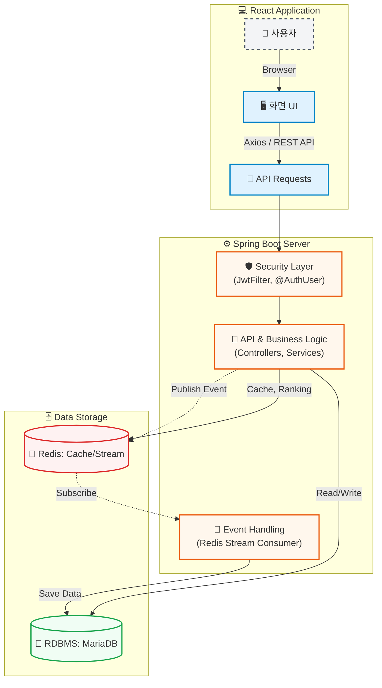

# 🍜 콩국수사전 (KongGuksu Dictionary)

**"내 주변, 가장 완벽한 콩국수 맛집을 찾는 여정"** > 전국 방방곡곡 숨겨진 콩국수 맛집을 찾고, 공유하고, 기록하는 지도 및 랭킹 서비스입니다.

## ✨ 주요 기능 (Key Features)

### 🗺️ 내 주변 콩국수 지도 & 디테일한 필터링

* **카카오맵 API**를 활용한 위치 기반 식당 탐색
* 콩 종류(백태/서리태 등), 판매 계절(사계절/여름 한정), 가격대별 상세 필터링 제공
* 현재 내 위치 기준 거리순 정렬 기능

### 🏆 실시간 콩국수 랭킹 시스템

* **인기순(저장수) & 별점순** 랭킹 제공
* **오늘의 핫플 vs 누적 핫플**: 매일 자정에 초기화되는 일간(Daily) 랭킹과 누적(All-time) 랭킹 분리 제공
* **Redis ZSet**을 활용한 실시간 점수 집계 및 **캐싱(Cache)**을 통한 빠른 응답 속도 보장

### 📖 나만의 사전 및 리뷰

* 마음에 드는 식당을 내 사전에 '저장'
* 방문 후기와 별점을 남겨 다른 유저들과 정보 공유 (리뷰 등록 시 실시간 통계 반영)

## 🛠 기술 스택 (Tech Stack)

### Frontend

* **Framework:** React.js
* **Styling:** Tailwind CSS
* **HTTP Client / Routing:** Axios, React-Router-Dom

### Backend

* **Framework:** Spring Boot, Spring Data JPA
* **Database:** MariaDB
* **In-Memory Store:** Redis (Ranking, Caching & Stream)
* **Security:** Spring Security, JWT

### Infrastructure & APIs

* **Map:** Kakao Map API

## 📐 시스템 아키텍처 (System Architecture)

